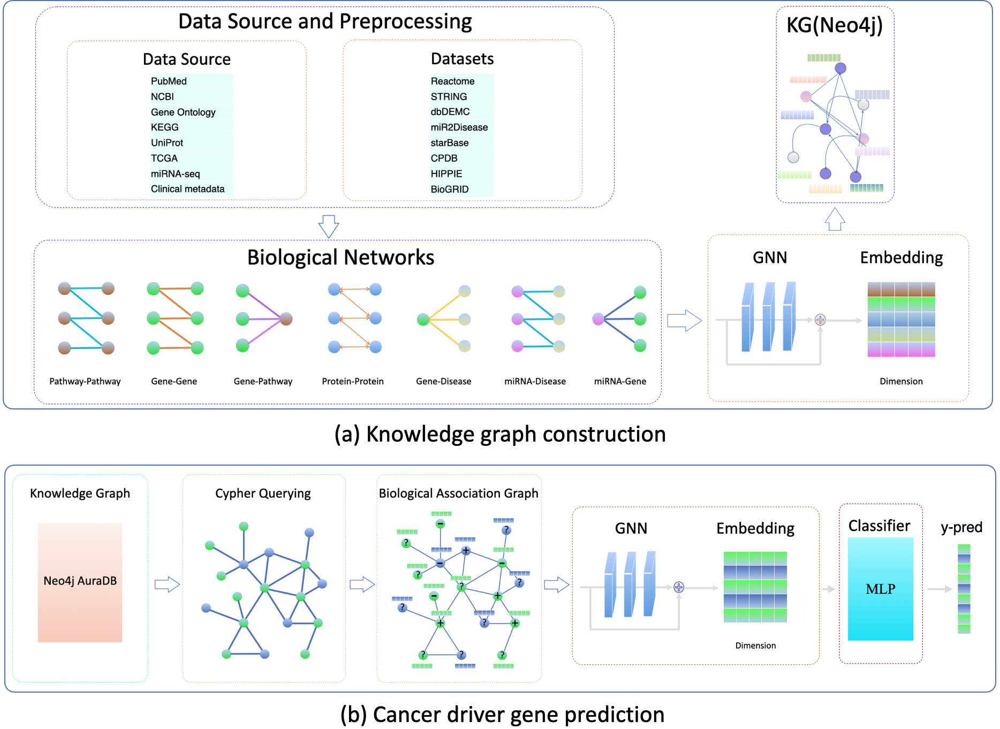

## A Knowledge Graph-Based Graph Neural Network Framework for Multi-Omics Applications,

This repository contains the code for our project,  
**"A Knowledge Graph-Based Graph Neural Network Framework for Multi-Omics Applications."** 

## Data Source

The dataset is obtained from the following sources:

- **[miRTarBase](https://mirtarbase.cuhk.edu.cn/~miRTarBase/miRTarBase_2025/index.php)**  
- **[TarBase](https://dianalab.e-ce.uth.gr/tarbasev9/downloads)**  
- **[miRNet](https://www.mirnet.ca/)**  

These databases provide curated and integrated protein-protein interaction (PPI) and pathway data for bioinformatics research.

## Setup and Get Started

1. Install the required dependencies:
   - `pip install -r requirements.txt`

2. Activate your Conda environment:
   - `conda activate gnn`

3. Install PyTorch:
   - `conda install pytorch torchvision torchaudio -c pytorch`

4. Install the necessary Python packages:
   - `pip install pandas`
   - `pip install py2neo pandas matplotlib scikit-learn`
   - `pip install tqdm`
   - `pip install seaborn`

5. Install DGL:
   - `conda install -c dglteam dgl`

6. Download the data from the built gene association graph using the link below and place it in the `data` directory before training:
   - [Download built graphs](https://drive.google.com/file/d/1l7mbTn2Nxsbc7LLLJzsT8y02scD23aWo/view?usp=sharing)

7. To train the model for prediction, run the following command:
   - `python main.py --in-feats 256 --out-feats 256 --num-heads 2 --num-layers 2 --lr 0.001 --input-size 2 --hidden-size 16 --feat-drop 0.5 --attn-drop 0.5 --epochs 201 --model_type GAT --net_type miRTarBase `

